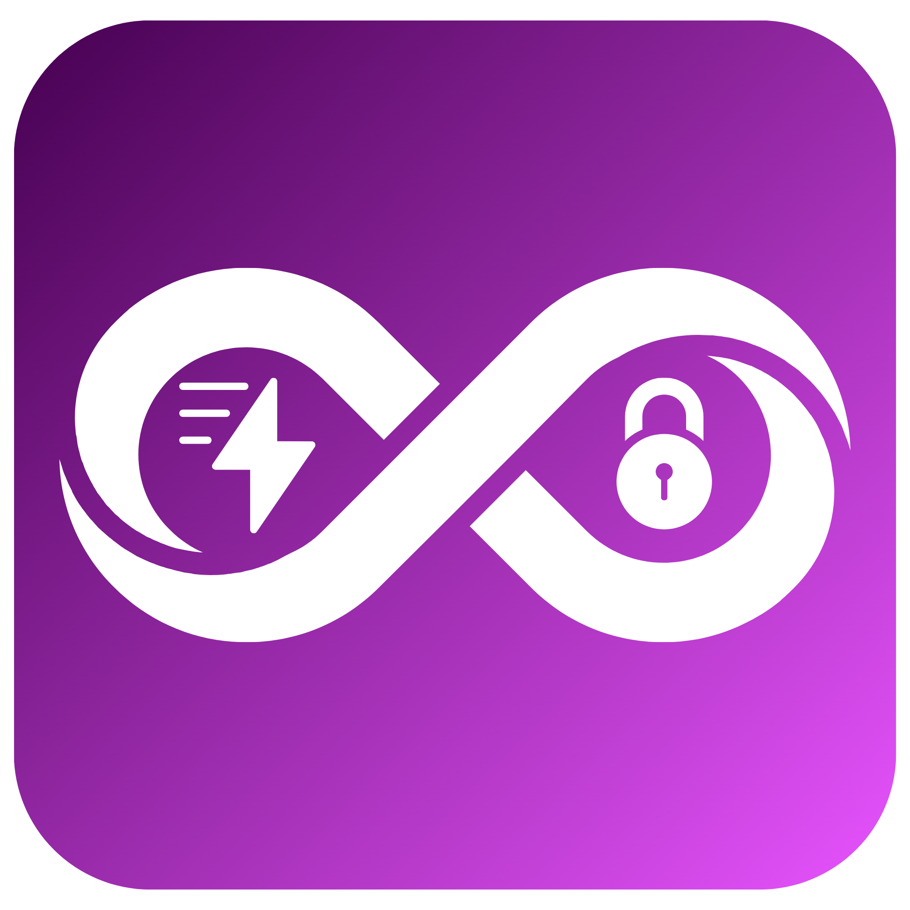
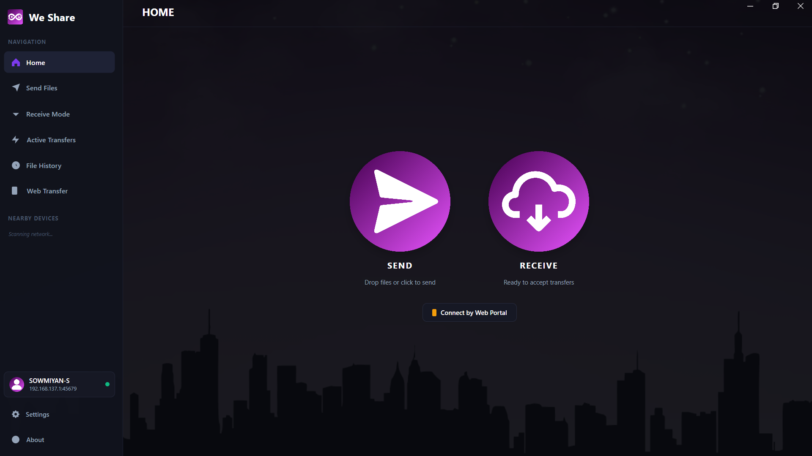
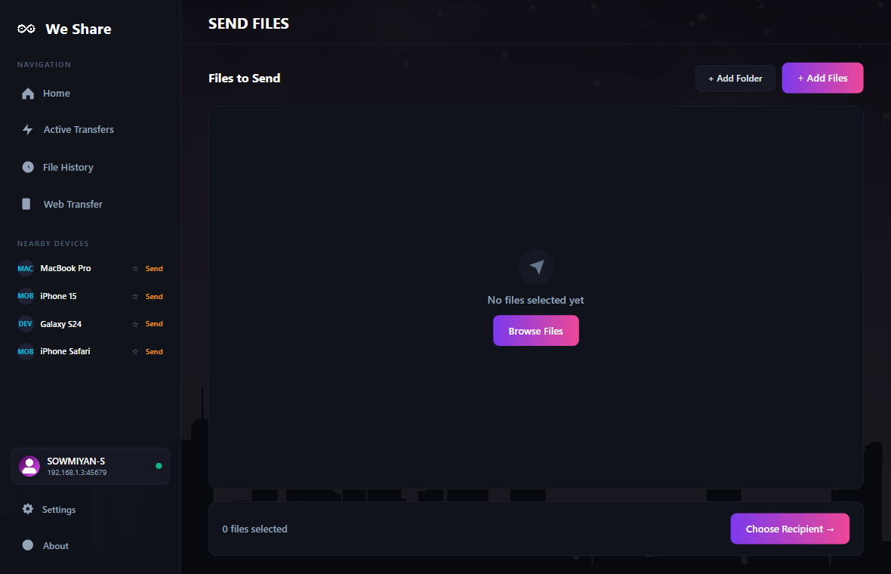
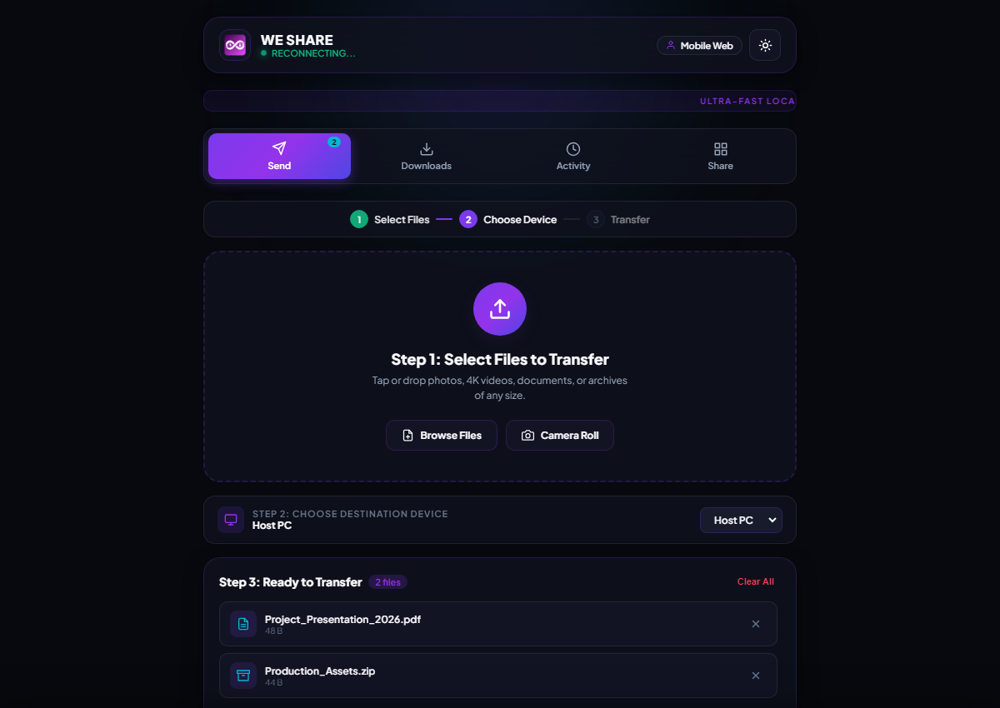
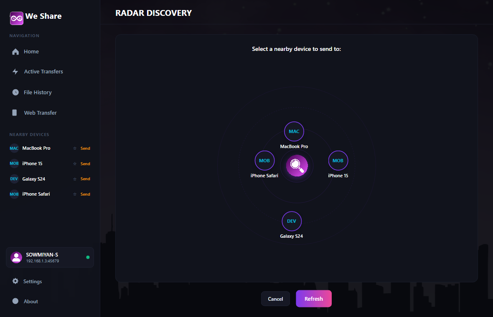
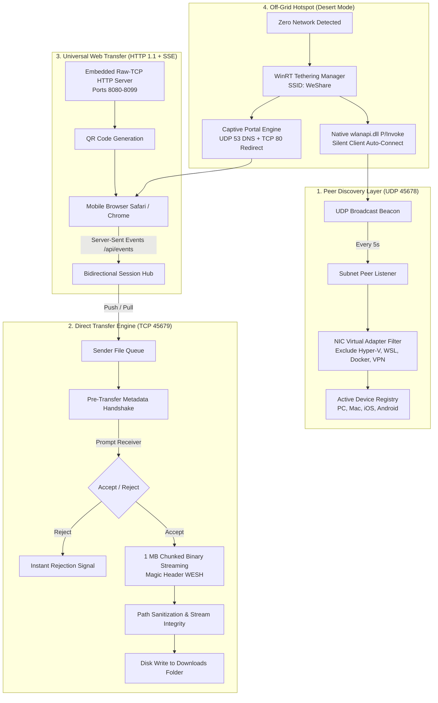

<div align="center">



# We Share

**High-Performance, Local-First File Transfer Utility for Windows and Mobile**

Fast, private, and cable-free data transfers across your local network &mdash; no internet, no cloud intermediaries, and zero bandwidth limits.

[](https://github.com/sowmiyan-s/We-Share/actions/workflows/build.yml)
[](LICENSE)
[](https://sowmiyan-s.github.io/We-Share/)
[](https://dotnet.microsoft.com/download/dotnet/8.0)
[](https://avaloniaui.net/)
[](https://github.com/sowmiyan-s/We-Share/releases)

<br />

[**Official Website**](https://sowmiyan-s.github.io/We-Share/) &bull;
[**Download Installer (.exe)**](https://github.com/sowmiyan-s/We-Share/raw/main/setup/WeShare_Setup_1.1.0.exe) &bull;
[**Download Portable (.zip)**](https://github.com/sowmiyan-s/We-Share/raw/main/setup/WeShare_Portable_win-x64.zip) &bull;
[**Brand Assets Kit**](https://github.com/sowmiyan-s/We-Share/tree/main/assets/brand) &bull;
[**Documentation**](https://sowmiyan-s.github.io/We-Share/how-to-use.html) &bull;
[**Release Notes**](https://sowmiyan-s.github.io/We-Share/patch-notes.html)

</div>

---

## Technical Documentation Suite

For comprehensive engineering specifications, architecture diagrams, wire protocols, and security models, consult the dedicated documentation guides:

| Document | Description |
| :--- | :--- |
| 🏛️ [**System Architecture**](docs/ARCHITECTURE.md) | Component diagrams, layered design, discovery pipeline, direct transfer state machine, captive portal subsystem, and threading model. |
| ⚡ [**Tech Stack & Specifications**](docs/TECH_STACK.md) | In-depth breakdown of .NET 8, Avalonia 11, WinRT APIs, Win32 `wlanapi.dll` P/Invoke, SQLite WAL mode, and Architectural Decision Records (ADRs). |
| 📡 [**Network Protocol Specification**](docs/PROTOCOL_SPEC.md) | Formal wire protocol: UDP beacon formats (Port 45678), TCP framed binary streaming (`WESH`), Web REST endpoints, and Server-Sent Events (SSE). |
| 🔒 [**Security & Privacy Model**](docs/SECURITY.md) | Threat modeling, pre-transfer consent handshakes, path traversal defense, network boundary isolation, and zero-telemetry architecture. |
| 🤝 [**Contributing Guide**](CONTRIBUTING.md) | Contributor setup, build instructions, code conventions, packaging with Inno Setup, and PR workflows. |

---

## Overview

**We Share** is an open-source desktop application and mobile web hub engineered for instantaneous local network file sharing. Built with **C# / .NET 8** and **Avalonia UI 11**, it bypasses the internet entirely, utilizing raw multi-threaded TCP sockets and local UDP broadcast discovery to achieve wire-speed transfers between computers and mobile devices.

Whether sending 50 GB 4K video reels across an office, moving vacation photos from an iPhone without cloud compression, or transferring files between laptops in an airplane with no Wi-Fi router, We Share provides seamless, zero-configuration local networking.

### Core Capabilities

- **Turbo Multi-Threaded TCP Sockets**: Maximizes physical network bandwidth (Gigabit Ethernet and Wi-Fi 6) with an enterprise 1 MB streaming buffer and live transfer telemetry.
- **AirDrop-Grade Radar Discovery**: Zero-configuration UDP broadcast detection on port 45678. Devices orbit an interactive radar scanner with instant tap-to-send dispatch.
- **Apple-Style Radar Receive Station**: Full-screen radar listening station with pulsing concentric rings and live status indicator.
- **Universal Web Transfer (Zero Client Apps)**: Bidirectional transfer with iOS, Android, macOS, and Linux devices via an embedded raw-TCP HTTP 1.1 / Server-Sent Events (SSE) server and instant camera QR code pairing.
- **Desert Mode (Off-Grid Hotspot)**: Automatically provisions an ad-hoc Wi-Fi network with WinRT Tethering Manager and silently handshakes peer laptops via native `wlanapi.dll` P/Invoke when no router is available.
- **Integrated Captive Portal**: Built-in DNS (port 53) and HTTP (port 80) redirection triggers native mobile captive network sheets, opening the Web Portal automatically.
- **Pre-Upload Authorization & Consent**: Explicit receiver prompts display sender identity, filename, and byte metrics before any file payload is transferred.
- **Single-Session Concurrency Lock**: Prevents connection collisions and protects socket buffers by enforcing dedicated one-to-one transfer channels.
- **Obsidian Violet Signature Aesthetics**: Custom dark glassmorphism interface with fluent button micro-animations and zero command prompt windows.
- **Reliable Local Persistence**: Embedded SQLite engine with Write-Ahead Logging (WAL mode) and async write serialization for instant history and settings access.

---

## Visual Showcase

<div align="center">

### Home Command Center & File Staging Queue
<p align="center">
  
  
</p>

### Universal Web Transfer & Radar Discovery
<p align="center">
  
  
</p>

</div>

---

## System Architecture



For full details, see the [Architecture Deep Dive](docs/ARCHITECTURE.md).

---

## Repository Structure

```text
We-Share/
├── assets/brand/           # Vector badges, app logos, and branding artwork
├── docs/                   # Documentation suite, architectural specs & website
│   ├── ARCHITECTURE.md     # System architecture & component design
│   ├── TECH_STACK.md       # Engineering stack & architectural decision records
│   ├── PROTOCOL_SPEC.md    # Formal wire protocol specification
│   ├── SECURITY.md         # Threat model & privacy safeguards
│   └── screenshot/         # High-resolution application screenshots
├── setup/                  # Compiled release installers and portable packages
├── src/
│   ├── WeShare.Core/       # Engine, TCP/UDP sockets, web server, crypto & SQLite
│   ├── WeShare.UI/         # Avalonia 11 XAML views, radar canvas & Obsidian theme
│   └── WeShare.Desktop/    # Windows runtime executable entry point
├── tools/                  # Diagnostic utilities & helper scripts
├── CONTRIBUTING.md         # Open-source developer & contribution guidelines
├── LICENSE                 # MIT License
├── publish.ps1             # Release build automation script
├── installer.iss           # Inno Setup 6 installer script
└── WeShare.sln             # Visual Studio .NET 8 solution
```

---

## Sharing Scenarios

### Scenario A: Computer to Computer (Same Network)
1. Launch **We Share** on both Windows computers.
2. Discovered computers appear on the **Radar Scan** and **Your Network** roster.
3. Click **Select & Send** or drag files directly into the window.
4. Tap the destination computer on the radar to initiate transmission.
5. The receiving PC displays an **Accept / Reject** prompt. Upon acceptance, the transfer streams at wire speed.

### Scenario B: Computer to Smartphone (Web Transfer)
1. Click **Web Transfer** in the sidebar on the PC.
2. Point any iPhone or Android camera at the on-screen QR code.
3. Tap the browser notification to open the local transfer session in Safari, Chrome, or Firefox.
4. On the PC, click **Choose Files to Send** to stage files for the mobile device.
5. Tap the incoming download link on the phone to save photos, videos, or documents directly into mobile storage.

### Scenario C: Smartphone to Computer
1. Scan the PC's on-screen QR code with your mobile camera.
2. Tap **Choose Files** on the mobile webpage and pick images, videos, or documents.
3. On the PC, click **Accept** on the incoming transfer prompt.
4. Files stream directly to the computer's designated Downloads folder.

### Scenario D: Off-Grid (Airplane, Vehicle, Outdoors)
1. When no Wi-Fi router is present, click **Start Desert Hotspot** on Laptop A.
2. Open We Share on Laptop B &mdash; the client auto-connects to the ad-hoc network within seconds via native Wi-Fi P/Invoke.
3. Both computers appear on each other's radar and transfer files without cellular or internet data.
4. Connected mobile phones automatically launch the We Share Web Portal via the built-in captive portal.

---

## Installation & Distribution

### Requirements
- **Operating System**: Windows 10 (Build 19041+) or Windows 11 (64-bit)
- **Runtime**: None required (all packages are self-contained)
- **Network**: Wi-Fi adapter or local Ethernet network

### 1. Windows Installer (Recommended)
Download the latest installer from the release assets:
- **File**: `WeShare_Setup_1.1.0.exe`
- **Silent Installation (IT / Enterprise)**:
  ```powershell
  .\WeShare_Setup_1.1.0.exe /VERYSILENT /SUPPRESSMSGBOXES /NORESTART
  ```

### 2. Standalone Portable Edition
Download the zero-install portable package:
- **File**: `WeShare_Portable_win-x64.zip`
- Extract anywhere (e.g., USB drive) and run `WeShare.Desktop.exe` directly without administrative privileges.

---

## Building from Source

### Prerequisites
- [.NET 8.0 SDK](https://dotnet.microsoft.com/download/dotnet/8.0)
- Visual Studio 2022 or VS Code with C# Dev Kit
- [Inno Setup 6](https://jrsoftware.org/isinfo.php) (optional, for installer compilation)

### Clone & Build
```powershell
# Clone repository
git clone https://github.com/sowmiyan-s/We-Share.git
cd We-Share

# Restore dependencies
dotnet restore

# Build solution in Release mode
dotnet build WeShare.sln -c Release

# Run desktop application
dotnet run --project src/WeShare.Desktop/WeShare.Desktop.csproj
```

### Packaging Release Binaries
To compile the single-file self-contained binary, portable ZIP, and Inno Setup installer:
```powershell
.\publish.ps1
```
Output binaries are generated in the `setup/` directory:
- `setup/WeShare_Setup_1.1.0.exe`
- `setup/WeShare_Portable_win-x64.zip`

---

## Security & Privacy

- **Local Network Isolation**: All data packets flow strictly over local layer-2/layer-3 network paths. No external servers or cloud services are involved.
- **Pre-Upload Verification**: Transfers require explicit destination acceptance before payload bytes are sent over the wire.
- **Path Traversal Protection**: All incoming file names and relative paths are sanitized and confined to the downloads sandbox.
- **Single-Session Lock**: Transfer sessions are locked to one peer at a time, eliminating connection interference or rogue injections.
- **Encrypted Local Storage**: Transfer logs, device preferences, and file metadata are maintained in a local SQLite database (`WeShare.db`) that never leaves the machine.
- **Zero Analytics & Telemetry**: We Share collects zero diagnostics, telemetry, or user analytics.

For comprehensive details, see the [Security Architecture](docs/SECURITY.md).

---

## Brand Assets & Media Kit

Official high-resolution logos, application icons, banners, and typography guides are maintained in the repository:
- **Directory**: [`assets/brand/`](assets/brand/)
- **Included Assets**:
  - High-resolution application logos (`APP LOGO.png`, `full png.png`)
  - Vector action glyphs (`send.png`, `receive.png`, `find.png`, `profile.png`)
  - Obsidian ecosystem background assets (`background.png`)

---

## Contributing

Contributions are welcomed. Please review our [Contributing Guide](CONTRIBUTING.md) for details on code style, branch workflows, and submitting pull requests.

---

## License

This project is licensed under the **MIT License** &mdash; see the [LICENSE](LICENSE) file for details.

Developed with precision by [Sowmiyan-S](https://github.com/sowmiyan-s).
