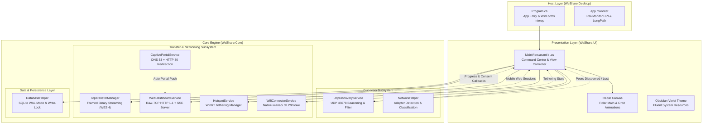
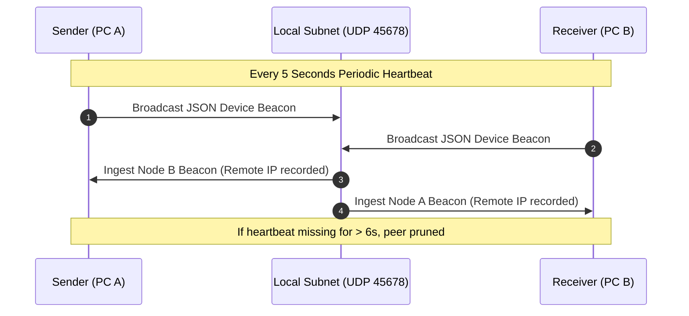
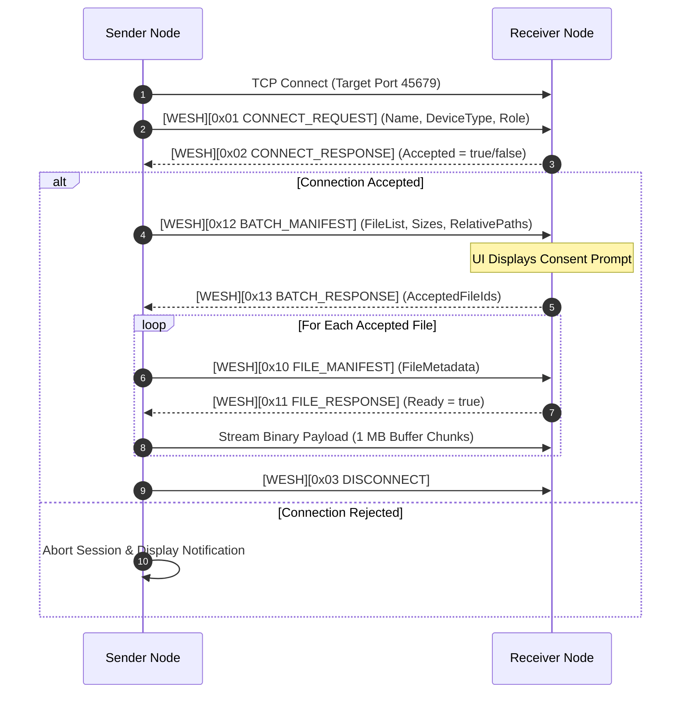
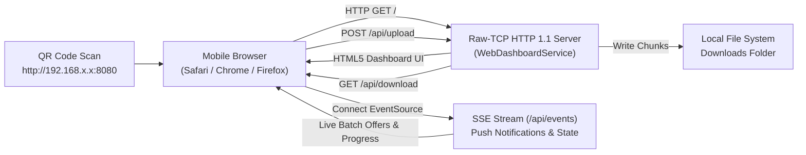
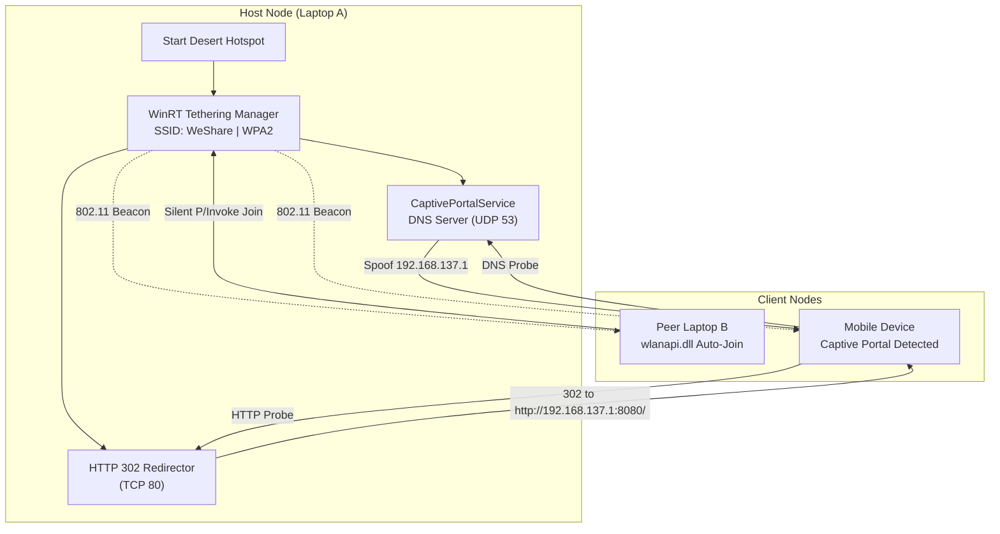

# We Share &mdash; System Architecture & Technical Design

This document details the software architecture, subsystem designs, and data flow of **We Share**, a local-first, peer-to-peer file transfer desktop application and mobile web portal built with **.NET 8** and **Avalonia UI 11**.

---

## 1. Architectural Principles

We Share is engineered around four core tenets:

1. **Local-First & Zero Cloud**: Data packets never leave the local layer-2 / layer-3 broadcast domain. There are no intermediary signaling servers, STUN/TURN relays, cloud storage buckets, or telemetry endpoints.
2. **Deterministic Wire-Speed Performance**: Multi-threaded, chunked raw TCP socket transfers designed to saturate physical medium limits (Gigabit Ethernet and Wi-Fi 6) using an enterprise 1 MB streaming buffer.
3. **Explicit Consent & Authorization**: Receivers must explicitly inspect and approve transfers before incoming bytes hit disk or socket buffers.
4. **Universal Interoperability**: While desktop nodes run high-performance compiled native apps, mobile devices (iOS, Android) and other platforms interface seamlessly via a zero-install, embedded web portal with real-time Server-Sent Events (SSE).

---

## 2. High-Level System Architecture

The solution is divided into three primary assemblies:

```text
WeShare Solution (WeShare.sln)
├── src/WeShare.Core       (Cross-platform engine, protocols, networking, data)
├── src/WeShare.UI         (Shared Avalonia 11 MVVM views, controls & styling)
└── src/WeShare.Desktop    (Windows WinExe host, WinRT & wlanapi integration)
```

### Component Interaction Diagram



---

## 3. Subsystem Breakdown

### 3.1. Peer Discovery Subsystem (`WeShare.Core.Discovery`)

Peer discovery is decentralized and zero-configuration, avoiding external rendezvous servers.



- **Beacon Emission**:
  - Broadcasts JSON-serialized `DeviceModel` payloads over UDP port `45678` every 5 seconds.
  - Broadcasts across adapter-specific directed broadcast addresses (e.g. `192.168.1.255`), followed by a global fallback to `255.255.255.255`.
- **Virtual Adapter Filtering**:
  - Identifies and filters out non-physical network interfaces (Hyper-V, WSL, Docker, VMware, TAP, and VPN tunnels) to prevent broadcasting over unreachable virtual subnets.
- **Desert Mode Targeted Unicast Pinging**:
  - When operating on the default Windows Tethering subnet (`192.168.137.x`):
    - Hotspot host (`192.168.137.1`) probes client addresses (`192.168.137.2` through `192.168.137.15`).
    - Connected clients send direct unicast pings straight to the gateway (`192.168.137.1`).
- **Heartbeat & Pruning Loop**:
  - A background task checks peer registrations every 2 seconds. Any peer not seen within 6.0 seconds is removed and triggers a `DeviceLost` event.

---

### 3.2. Direct Transfer Subsystem (`WeShare.Core.Transfer.TcpTransferManager`)

High-volume data exchange uses raw TCP streaming with an explicit consent handshake and structured packet framing.



#### Binary Frame Structure (`WESH`)
All TCP control and payload negotiation frames share a 9-byte header:

```text
 0                   1                   2                   3
 0 1 2 3 4 5 6 7 8 9 0 1 2 3 4 5 6 7 8 9 0 1 2 3 4 5 6 7 8 9 0 1
+-+-+-+-+-+-+-+-+-+-+-+-+-+-+-+-+-+-+-+-+-+-+-+-+-+-+-+-+-+-+-+-+
|   'W' (0x57)  |   'E' (0x45)  |   'S' (0x53)  |   'H' (0x48)  | Magic (4 Bytes)
+-+-+-+-+-+-+-+-+-+-+-+-+-+-+-+-+-+-+-+-+-+-+-+-+-+-+-+-+-+-+-+-+
|  MsgType (1B) |                 Payload Length (4 Bytes)      |
+-+-+-+-+-+-+-+-+-+-+-+-+-+-+-+-+-+-+-+-+-+-+-+-+-+-+-+-+-+-+-+-+
|                        Payload Data ...                       |
+-+-+-+-+-+-+-+-+-+-+-+-+-+-+-+-+-+-+-+-+-+-+-+-+-+-+-+-+-+-+-+-+
```

#### Transfer Engine Features:
- **1 MB Enterprise Buffer (`EnterpriseBufferSize = 1048576`)**: Optimized for high-throughput SATA/NVMe SSD sequential writes and Gigabit/Wi-Fi 6 saturation.
- **Folder Preservation**: Preserves relative paths during batch directory transfers while sanitizing paths to prevent directory traversal outside the designated download folder.
- **Single-Session Lock**: The active receiver locks onto a single peer session, rejecting rogue concurrent connections until the transfer finishes or is explicitly terminated.
- **Resend Support**: Individual failed or declined files can be requested again via `0x14 RESEND_REQUEST` without re-transmitting the entire batch.

---

### 3.3. Universal Web Transfer Subsystem (`WeShare.Core.Transfer.WebDashboardService`)

To eliminate the requirement of installing client apps on iOS, Android, macOS, or Linux, We Share embeds a custom raw-TCP HTTP 1.1 server.



- **Zero Administrative Elevation**: Uses `System.Net.Sockets.TcpListener` rather than `HttpListener` (`http.sys`), avoiding Windows ACL registration requirements or UAC elevation.
- **Dynamic Port Hunting**: Automatically attempts to bind to port `8080`. If occupied, sequentially hunts through ports `8081` to `8099`.
- **Server-Sent Events (SSE)**: The `/api/events` endpoint provides real-time event streaming to mobile browsers for batch manifests, authorization prompts, and progress updates.
- **Embedded Web Client UI**: Complete responsive HTML5/CSS3/ES6 single-page web app embedded directly in C# string assets (`WebDashboardHtml.cs`), featuring file pickers, camera QR support, and upload/download progress bars.

---

### 3.4. Desert Mode Subsystem (Off-Grid Hotspot & Captive Portal)

When operating off-grid without an external router or access point (e.g., vehicles, aircraft, remote fields), We Share provides an autonomous network bridge.



1. **Hotspot Provisioning**:
   - Leverages `Windows.Networking.NetworkOperators.NetworkOperatorTetheringManager` to instantiate a local Wi-Fi hotspot (`SSID: WeShare`, `Passphrase: weshare1`).
2. **Client Auto-Join (`WifiConnectorService`)**:
   - Peer laptops invoke Windows Native Wi-Fi APIs via `wlanapi.dll` P/Invoke (`WlanOpenHandle`, `WlanScan`, `WlanSetProfile`, `WlanConnect`).
   - Automatically connects to the `WeShare` SSID without elevation or user password input.
   - **State Restoration**: Saves the user's previous Wi-Fi connection profile and restores it upon application exit.
3. **Captive Portal Service (`CaptivePortalService`)**:
   - Binds a DNS server on UDP `192.168.137.1:53` responding to all probe domain queries (`captive.apple.com`, `connectivitycheck.gstatic.com`, `msftconnecttest.com`) with `192.168.137.1`.
   - Binds an HTTP server on TCP `192.168.137.1:80` returning an immediate `302 Found` redirect to `http://192.168.137.1:8080/`.
   - Triggers native "Log in to Wi-Fi network" sheets on iOS and Android devices, opening the We Share Web Portal automatically.

---

### 3.5. Persistence Subsystem (`WeShare.Core.Data.DatabaseHelper`)

We Share maintains transfer logs, device pairings, and preferences in an embedded SQLite database (`weshare.db`).

- **Location**: `%LocalAppData%\WeShare\WeShare.db`
- **Concurrency & Reliability**:
  - Enables SQLite Write-Ahead Logging (`PRAGMA journal_mode=WAL; PRAGMA synchronous=NORMAL;`) allowing concurrent non-blocking reads during active disk writes.
  - Enforces a dedicated `SemaphoreSlim(1, 1)` write lock across asynchronous database tasks to prevent `database is locked` race conditions during high-frequency transfer telemetry writes.

---

### 3.6. Presentation Layer (`WeShare.UI`)

The user interface is built on **Avalonia UI 11**, using a reactive MVVM-style pattern and custom Skia rendering.

- **Obsidian Violet Design System**: Deep obsidian palette (`#0B0B10`, `#13131A`, `#1C1B29`) paired with neon violet accents (`#8B5CF6`, `#A78BFA`) and translucent glassmorphism surfaces.
- **AirDrop-Style Radar Scanner**:
  - Implements dynamic trigonometry (`X = CenterX + Radius * cos(theta)`, `Y = CenterY + Radius * sin(theta)`) to distribute discovered peers evenly across concentric animated rings.
  - Supports interactive drag-and-drop file targets directly onto peer radar nodes.
- **Hardware Acceleration**: Built with Avalonia's Direct3D / Skia rendering engine for responsive 60+ FPS animations without high CPU utilization.

---

## 4. Lifecycle & Threading Model

```text
Application Startup
  │
  ├── 1. Load configuration and initialize SQLite WAL store
  ├── 2. Initialize NetworkHelper and determine active physical adapters
  ├── 3. Start UdpDiscoveryService listener on 0.0.0.0:45678
  ├── 4. Start TcpTransferManager listener on dynamic/fixed port 45679
  ├── 5. Start WebDashboardService raw-TCP server on port 8080 (or hunt 8081-8099)
  └── 6. Launch Avalonia Desktop MainWindow
```

All background operations (UDP beacon listening, TCP socket reads, HTTP requests, DNS queries) are scheduled on the .NET `ThreadPool` via `Task.Run` with `CancellationToken` support, guaranteeing that the Avalonia UI Dispatcher thread remains responsive at all times.
