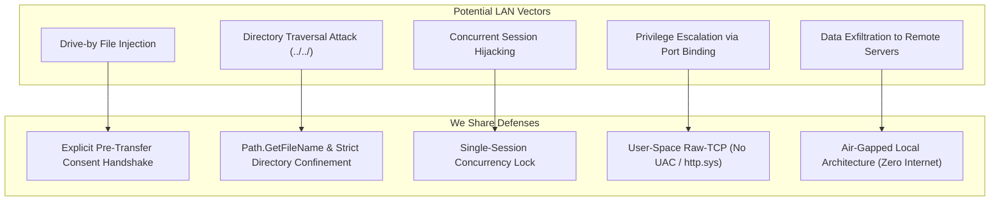

# We Share &mdash; Security & Privacy Architecture

This document details the security model, threat mitigations, and privacy safeguards engineered into **We Share**.

---

## 1. Security Philosophy

We Share is architected from the ground up on the principle of **Local-First Isolation**:
- **Zero Cloud Intermediaries**: Data packets travel exclusively across physical layer-2 / layer-3 local network boundaries. There is no central server, relay, or cloud bridge.
- **Zero Telemetry**: No user analytics, diagnostic pings, crash logs, or IP registries are recorded or transmitted off the host machine.
- **Zero Drive-By Transfers**: Unsolicited file payloads are impossible; all incoming transfers require affirmative user consent on the receiver before payload bytes are accepted over the network.

---

## 2. Threat Model & Mitigations



### 2.1. Drive-By File Injection Mitigation
- **Threat**: A rogue device on the same Wi-Fi network attempts to transmit malicious executables onto peer machines without user interaction.
- **Mitigation**:
  - Prior to initiating any file transfer, `TcpTransferManager` and `WebDashboardService` require two-tier consent:
    1. **Connection Pairing Consent**: Peer identity, name, and IP must be accepted.
    2. **Manifest Authorization**: An explicit dialog displays the filename, count, and size in bytes.
  - If the receiver declines or ignores the prompt, the TCP connection is closed immediately without writing bytes to disk.

### 2.2. Directory Traversal Defense
- **Threat**: A malicious sender constructs a crafted manifest containing relative path sequences such as `../../Windows/System32/malicious.dll` to overwrite system files.
- **Mitigation**:
  - When extracting files, all path separators (`/` and `\`) in incoming `FileName` fields are sanitized.
  - Relative paths from folder transfers are evaluated against the designated download directory:
    ```csharp
    string fullDestination = Path.GetFullPath(Path.Combine(saveDirectory, sanitizedRelativePath));
    if (!fullDestination.StartsWith(Path.GetFullPath(saveDirectory), StringComparison.OrdinalIgnoreCase))
    {
        throw new SecurityException("Directory traversal attempt detected and blocked.");
    }
    ```
  - Any file attempting to resolve outside the sandbox boundary is immediately aborted.

### 2.3. Session Hijacking & Race Conditions
- **Threat**: An attacker attempts to inject packets or disrupt an ongoing transfer by connecting concurrently to port `45679`.
- **Mitigation**:
  - The receiver operates under a strict **Single-Session Lock**:
  - While a transfer session is active, any incoming connection from an unauthenticated IP is refused or rejected.
  - Sockets enforce non-blocking timeouts with cancellation tokens, cleaning up abandoned sockets automatically.

### 2.4. Operating System Privilege Sandboxing
- **Threat**: Network services running with administrative / elevated privileges expand the attack surface of the host OS.
- **Mitigation**:
  - **No UAC Elevation**: We Share runs entirely within normal user privileges.
  - **No `http.sys` Dependency**: Standard Windows `HttpListener` requires administrative URL registrations. We Share implements a custom raw-TCP server directly on user-space `TcpListener`, requiring no firewall rule additions or administrator permissions.
  - **Native Wi-Fi Interop**: Auto-connection in Desert Mode uses Win32 `wlanapi.dll` calls that execute strictly in user mode.

### 2.5. Desert Mode (Ad-Hoc Network) Isolation
- In Desert Mode, the host operates an ad-hoc Wi-Fi network using WPA2-Personal encryption with programmatic passphrases.
- The subnet is strictly private (`192.168.137.0/24`).
- Captive portal redirection only responds to local DNS queries and forwards directly to the local port, preventing external DNS tunneling.

---

## 3. Local Data Privacy & Storage

We Share persists application data exclusively on the local filesystem:

| Data Type | Storage Location | Sensitivity | Remote Sync |
| :--- | :--- | :--- | :--- |
| **Transfer Logs** | `%LocalAppData%\WeShare\WeShare.db` | Low (File metadata & timestamps) | Never |
| **User Settings** | `%LocalAppData%\WeShare\WeShare.db` | Low (Device alias & download path) | Never |
| **Saved Profiles** | Memory-only (during Desert Mode execution) | Low (Restored and discarded on exit) | Never |

The SQLite database file is located inside the user's private application data directory, inheriting the operating system's file access control lists (ACLs).

---

## 4. Vulnerability Disclosure

If you discover a security vulnerability within We Share, please report it responsibly:
- Submit reports directly to the maintainer via GitHub Private Security Advisories:
  [https://github.com/sowmiyan-s/We-Share/security/advisories](https://github.com/sowmiyan-s/We-Share/security/advisories)
- Please do not open public issues for undisclosed security vulnerabilities.
